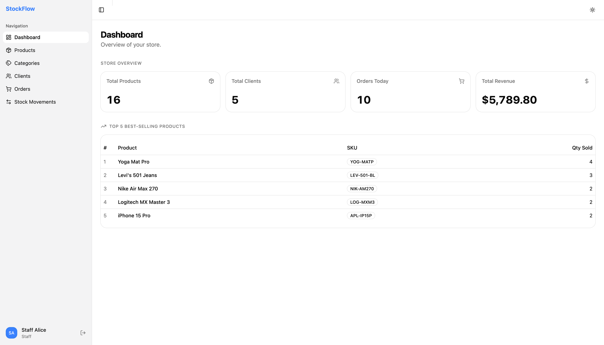

# StockFlow — Mini ERP

A full-stack inventory and order management system built with Node.js, Express, PostgreSQL, React, and shadcn/ui.

## Preview



## Stack

| Layer    | Tech                                      |
|----------|-------------------------------------------|
| Backend  | Node.js · Express · PostgreSQL · JWT      |
| Frontend | React 19 · Vite · shadcn/ui · Tailwind v4 |

---

## Prerequisites

Install these before starting:

- **Node.js 18+** — https://nodejs.org
- **PostgreSQL 14+**
  - macOS: `brew install postgresql@16 && brew services start postgresql@16`
  - Ubuntu/Debian: `sudo apt install postgresql postgresql-contrib && sudo systemctl start postgresql`
  - Windows: https://www.postgresql.org/download/windows (use the installer)
- **npm** (comes with Node.js)

---

## 1 — Clone & install

```bash
git clone <repo-url>
cd <repo-folder>

# Install backend dependencies
cd backend
npm install

# Install frontend dependencies
cd ../frontend
npm install
```

---

## 2 — Set up PostgreSQL

### macOS

```bash
# Create the postgres role (skip if it already exists)
psql -d postgres -c "CREATE ROLE postgres WITH SUPERUSER LOGIN PASSWORD 'yourpassword';"

# Create the database
psql -U postgres -c "CREATE DATABASE stockflow;"
```

### Linux

```bash
# Switch to the postgres system user first
sudo -u postgres psql -c "CREATE DATABASE stockflow;"

# Optional: set a password for the postgres role
sudo -u postgres psql -c "ALTER ROLE postgres WITH PASSWORD 'yourpassword';"
```

### Windows

Open **pgAdmin** or the **psql shell** from the Start menu and run:

```sql
CREATE DATABASE stockflow;
```

---

## 3 — Configure environment variables

From the project root:

```bash
cd backend
cp .env.example .env
```

Open `backend/.env` and fill in your values:

```env
PORT=3001
NODE_ENV=development

DB_HOST=localhost
DB_PORT=5432
DB_NAME=stockflow
DB_USER=postgres
DB_PASSWORD=yourpassword

JWT_SECRET=change_this_to_a_long_random_string
JWT_EXPIRES_IN=7d
```

---

## 4 — Run migrations

From inside the `backend/` folder:

```bash
npm run migrate
```

This creates all the tables: `users`, `categories`, `products`, `clients`, `orders`, `order_items`, `stock_movements`.

---

## 5 — Seed the database

From inside the `backend/` folder:

```bash
npm run seed
```

Populates the database with demo data: 1 admin, 2 staff users, 5 categories, 15 products, 5 clients, 10 orders, and stock movements.

> **Run this only once.** Running it again will fail with a duplicate key error because emails and SKUs are unique. If you need to reseed, drop and recreate the database first, then re-run migrate and seed.

### Demo credentials

| Role  | Email               | Password |
|-------|---------------------|----------|
| Admin | admin@stockflow.com | admin123 |
| Staff | alice@stockflow.com | staff123 |
| Staff | bob@stockflow.com   | staff123 |

### Role permissions

| Feature                                        | Admin | Staff |
|------------------------------------------------|:-----:|:-----:|
| Dashboard                                      | ✅    | ❌    |
| Products — view / create / edit                | ✅    | ❌    |
| Products — delete                              | ✅    | ❌    |
| Categories — full CRUD                         | ✅    | ❌    |
| Clients — view / create / edit / delete        | ✅    | ❌    |
| Orders — create / manage items / change status | ✅    | ✅    |
| Stock movements — add / view history           | ✅    | ✅    |

---

## 6 — Start the servers

Open **two terminals** from the project root:

**Terminal 1 — Backend** (port 3001):

```bash
cd backend
npm run dev
```

**Terminal 2 — Frontend** (port 5173):

```bash
cd frontend
npm run dev
```

Then open **http://localhost:5173** in your browser.

---

## Project structure

```
stockflow/
├── backend/
│   ├── src/
│   │   ├── controllers/     # Route handlers
│   │   ├── models/          # DB queries (pg pool)
│   │   ├── middlewares/     # Auth (JWT), error handling
│   │   ├── routes/          # Express routers
│   │   ├── db/
│   │   │   ├── pool.js      # pg Pool instance
│   │   │   ├── migrations/  # SQL schema files
│   │   │   ├── migrate.js   # Migration runner
│   │   │   └── seed.js      # Demo data seeder
│   │   ├── app.js           # Express app setup
│   │   └── index.js         # Entry point
│   └── .env.example
└── frontend/
    └── src/
        ├── components/
        │   ├── layout/      # AppSidebar, SiteHeader, AppLayout
        │   └── ui/          # shadcn/ui components
        ├── hooks/
        │   └── useAuth.js
        ├── lib/
        │   └── api.js       # Axios instance with JWT interceptor
        └── pages/           # One file per module
```

---

## Troubleshooting

**`psql: error: connection refused`** — PostgreSQL is not running. Start it with `brew services start postgresql@16` (macOS) or `sudo systemctl start postgresql` (Linux).

**`role "postgres" does not exist`** — Run the CREATE ROLE command from step 2 using your system's default superuser (`psql -d postgres` on macOS, `sudo -u postgres psql` on Linux).

**`database "stockflow" does not exist`** — You skipped the CREATE DATABASE step. Run it then redo migrate and seed.

**Seed fails with duplicate key error** — The database was already seeded. No action needed unless you want fresh data; in that case drop and recreate the database, re-run migrate, then seed again.

**Frontend shows blank page or API errors** — Make sure the backend is running on port 3001 before opening the frontend.
